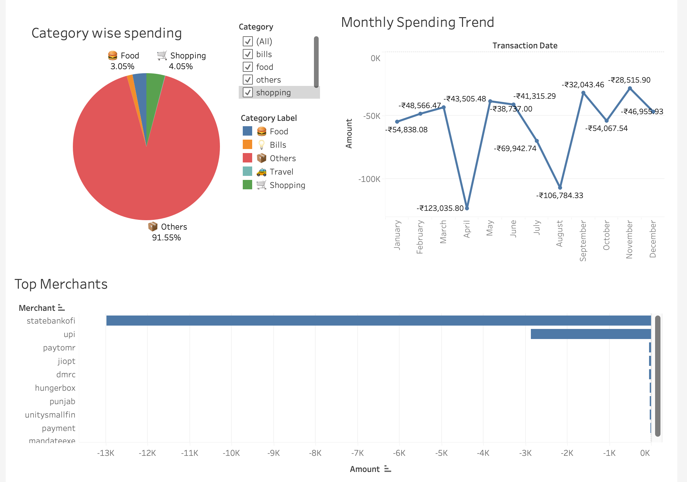

# 💳 UPI Transaction Analysis Dashboard

## 📌 Overview

This project analyzes personal UPI transaction data to understand spending patterns, categorize expenses, and visualize insights using Tableau.

---

## ⚙️ Tech Stack

* Python (Pandas, NumPy)
* Tableau
* CSV / Excel

---

## 🧹 Data Cleaning

* Handled missing values using forward fill
* Standardized column names
* Converted date columns to datetime format
* Extracted merchant names from noisy transaction descriptions

---

## 🧠 Feature Engineering

* Created `amount` column (deposit - withdrawal)
* Categorized transactions into food, travel, shopping, bills, and others
* Extracted merchant-level insights

---

## 📊 Key Insights

* Majority of transactions fall under "Others" due to UPI transfers
* High spending spikes observed in April and August due to one-time events
* Regular spending patterns are relatively stable
* Transactions are concentrated among UPI-based merchants

---

## 📸 Dashboard Preview

---

## 🚀 Future Improvements

* Improve categorization using NLP/ML
* Separate recurring vs one-time expenses
* Build automated pipeline

---

## 🧠 Learnings

* Importance of cleaning real-world noisy data
* Handling unstructured transaction descriptions
* Building interactive dashboards for insights
